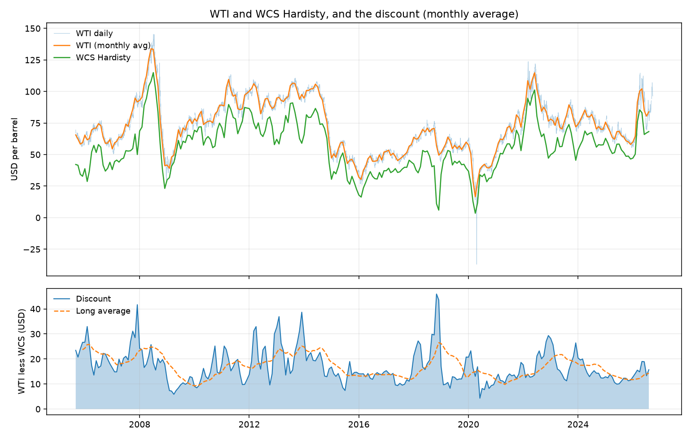

# Canadian Crude Differential

A pipeline that pulls Canadian and US crude benchmarks, computes the WCS
Hardisty discount to WTI, and publishes a formatted Excel recap with a chart and
written commentary. History runs from 2005.

Built because the WCS differential is the single most important price in
Canadian energy, and the two legs of it do not come from the same place or on
the same calendar. WTI is a daily series from the US EIA. WCS is a monthly
average from the Government of Alberta. Getting the spread right is mostly
about refusing to pretend those are the same thing.



252 monthly observations, September 2005 to August 2026. WTI from the US EIA,
WCS Hardisty from the Government of Alberta.

## What the differential is

Western Canadian Select is a heavy sour blend priced at Hardisty, Alberta. WTI
is a light sweet crude priced at Cushing, Oklahoma. WCS trades at a discount for
three separable reasons:

**Quality.** Heavy sour barrels yield less gasoline and diesel per barrel and
need coking capacity to process. Only some refineries can take them, so they
price below light sweet on the merits.

**Transport.** Hardisty is a long way from the refineries that want the barrel.
The discount has to cover the cost of getting it to PADD 2 or the US Gulf Coast.

**Egress.** This is the part that moves. When pipeline capacity out of Alberta is
tight, the marginal barrel moves by rail, which costs several dollars more than
pipe. The differential widens toward rail economics. When there is spare pipeline
capacity, it compresses back toward tariff plus quality.

The first two are slow moving. The third is why the differential can double in a
few weeks, and it is what the driver series in this project are trying to track:
Enbridge Mainline apportionment as a direct read on egress tightness, Cushing
inventories as a read on how full the system is, and PADD 2 refinery utilization
as a read on demand for the barrel. Trans Mountain Expansion entering service in
2024 added meaningful egress and changed the structural range, so any comparison
against pre-2024 history needs that caveat attached.

## Quick start

```bash
git clone https://github.com/inalali2/canadian-crude-differential.git
cd canadian-crude-differential
python -m venv .venv && source .venv/bin/activate
pip install -r requirements.txt

# Try it with synthetic data, no API key needed
python -m src.cli init
python -m src.cli demo
python -m src.cli report
```

For real data, get a free EIA key at
https://www.eia.gov/opendata/register.php then:

```bash
cp .env.example .env     # paste your key in
rm data/crude.db         # clear the synthetic rows first
python -m src.cli run
```

## Commands

| Command | What it does |
|---|---|
| `init` | Create the database and folders |
| `ingest` | Fetch every configured source. `--only wti_spot` to limit |
| `report` | Build the Excel file, chart and recap from stored data |
| `run` | Ingest then report |
| `status` | Row counts and date coverage per metric and source |
| `discover --route <route> --contains <text>` | List valid EIA series ids for a route |
| `demo` | Load clearly labelled synthetic data |

## Data sources

| Series | Source | Method | Reliability |
|---|---|---|---|
| WTI Cushing spot | EIA series RWTC | API v2 | Stable |
| Brent spot | EIA series RBRTE | API v2 | Stable |
| Cushing ending stocks | EIA series WCESTP11 | API v2 | Stable, revised |
| PADD 2 refinery utilization | EIA | API v2, id via `discover` | Stable once configured |
| WCS Hardisty | Alberta Economic Data API | API, then manual CSV | Stable, **monthly** |
| Mainline apportionment | Enbridge notices | Manual CSV | No stable feed |

### The monthly constraint

WCS from Alberta is a **monthly average**, not a daily settlement. A daily WCS
assessment is a commercial product from Argus, Platts or NE2 and is not free.

So this pipeline averages daily WTI to the month before taking the spread. Both
legs then cover the same window and the comparison is honest. The wrong answer,
and the common one, is to forward fill the monthly WCS number across every
trading day and difference it against daily WTI. That produces a sawtooth that
is an artefact of the fill, not a market move.

The code supports daily alignment too (`wcs_frequency: daily` in config.yaml)
for anyone with a real daily assessment. It carries the last print forward for
a few sessions, records how stale each one was, and reports what share of rows
were carried.

### Feed quirks worth knowing about

The Alberta feed names its type column `"Type "`, with a trailing space, and
carries null placeholder rows back to 1986 from before WCS existed as a
benchmark. Requesting both WCS and WTI in one call returns them interleaved.
All three are handled and all three have tests. This is the normal condition of
public data, not an unusual case.

### Manual fallback

If a feed breaks, fill the CSV and the pipeline keeps running:

```csv
# data/manual/wcs_hardisty.csv
date,price
2026-07-01,67.16
2026-08-01,68.21
```

```csv
# data/manual/apportionment.csv
obs_date,value
2026-08-01,12
2026-09-01,18
```

That fallback is not laziness. On a real desk the backup for a broken feed is a
person pasting the number in before the morning run, and a pipeline that cannot
accept that is a pipeline that goes dark on the day it matters most.

## Design decisions

**Long table, not wide.** Observations are stored as
`(metric, obs_date, value, units, source)`. Adding a series needs a config entry,
not a schema migration.

**Idempotent by primary key.** `(metric, obs_date)` is the key and writes are
upserts. Running the pipeline twice changes nothing. Running it on a cron is
safe. EIA revises weekly inventory data, so an upsert that overwrites the value
while preserving the first-seen timestamp is the correct behaviour, not a
convenience.

**Calendar alignment is explicit.** The two legs arrive at different
frequencies, so the code names which one it is using and aligns accordingly.
Monthly mode averages daily WTI to the month and drops any partial month with
fewer than twelve trading days, so the incomplete current month never enters as
a real data point. Daily mode carries WCS forward a few sessions and records
the staleness. A spread built by joining two series and ignoring this quietly
produces wrong numbers.

**Regimes, not one average.** Trans Mountain Expansion entered service in May
2024 and changed the structural range. A single mean spanning that is a number
with no meaning, so the report splits the history at each configured break.
Boundary periods use half-open intervals, because a closed interval counts the
boundary month in both regimes and inflates the earlier average. That was a
real bug, caught by a test.

**Both sign conventions, named.** `discount` is WTI less WCS and is positive.
`wcs_minus_wti` is the quoted basis and is negative. There is no column called
just `differential`, because that is how sign errors get shipped.

**Correlations on changes, not levels.** Two trending series correlate with each
other and with the calendar. Period over period differences are the honest
version of the question. There is a test for this specific failure.

**The API key never reaches a log.** urllib3 prints full request URLs at DEBUG
level, so `-v` would otherwise leak the key into the terminal and into any
pasted output. Its logger is pinned to INFO and error messages redact the key.

**One bad feed does not kill the run.** Each source is fetched, logged, and
failures are recorded in `ingest_log` while the rest continues. `status` shows
what actually landed.

**No price prediction.** There is no model here forecasting the differential.
The pipeline measures and presents. A regression on five years of spread data
would be a worse answer than reading the apportionment notice.

## Output

Each run writes to `output/`:

- `crude_differential_<date>.xlsx` with a Summary sheet (headline numbers,
  regimes, driver correlations, data quality), a Series sheet with a native
  Excel line chart that stays live when the sheet is extended, and a Changes
  sheet
- `discount_history.png` for the README
- `recap_<date>.md` with the numbers filled in and the commentary left blank

The recap deliberately leaves two sections empty. The pipeline produces inputs.
The analysis is written by a person.

## Tests

```bash
python -m pytest tests -q
```

27 tests covering the cases that actually bite: monthly WTI averaging before
the spread, partial current months being dropped, a month-end stamped source
still aligning to month start, sign convention, carry forward within and beyond
the staleness threshold, rows before the first WCS print, regime boundaries not
double counting, revisions overwriting rather than duplicating, nulls not stored
as zeros, correlation on changes not levels, and every quirk of the Alberta feed
including the trailing space in its type column.

## Findings

**The full-period average is not worth quoting.** Across 252 months the
discount averaged $16.98, but that number spans the 2008 crash, the 2018
Alberta curtailment, the 2020 demand collapse and the 2024 opening of Trans
Mountain Expansion. It is an average of four different markets. This is why the
report splits the history rather than reporting one mean.

**TMX moved the level, and compressed the range far more.** Before TMX entered
service in May 2024 the discount averaged $17.43 across 224 months, with a range
of $4.34 to $45.93. In the 28 months since, it has averaged $13.42 with a range
of $9.95 to $18.99.

The $4 shift in the mean is the headline, and it is roughly what you would
expect from adding around 590,000 barrels per day of egress to tidewater. The
more interesting number is the range. Pre-TMX the discount spanned $41.59
between its extremes; post-TMX it has spanned $9.04. Egress scarcity is not
just a level effect on the differential, it is most of its volatility. When
Alberta has spare pipeline the discount sits near transport plus quality and
stays there. When it does not, the marginal barrel has to clear by rail or not
move at all, and the price gaps.

**The tails carry the information.** The $45.93 maximum is November 2018, when
Alberta production overwhelmed egress, storage filled, and the province
responded with mandated curtailment. The chart shows it as a single spike that
dwarfs everything around it. A normal distribution is the wrong mental model
here: the differential spends most of its time in a narrow band set by transport
economics and occasionally dislocates when capacity binds.

**The driver correlations came back weak, and that is the honest result.**
Against monthly changes over a trailing three year window, Cushing inventories
correlate at +0.11 and Brent at -0.04. Neither is a signal.

That is not a surprise on reflection, and the null result is more informative
than a strong one would have been. Cushing is a US midcontinent storage hub. The
WCS discount is set by Alberta egress. The series that should track it is
Enbridge Mainline apportionment, which is published as monthly PDF notices with
no stable feed, and is therefore not in this dataset. The pipeline supports it
as a manually maintained CSV for exactly that reason. Testing the variable you
can get instead of the one that matters is the commonest way to produce a
confident wrong answer, so this section reports what was actually measured.

**Where it sits now.** The August 2026 reading is $15.69, or 18.7 percent of
WTI. That is above the post-TMX average of $13.42, near the top of the post-TMX
range, and in the 85th percentile of the trailing twelve months. It has widened
$2.39 over one month and $4.52 over twelve.

## Limitations

- WCS here is a monthly average assessment, not an exchange settlement. A desk
  would trade off a daily Argus or Platts assessment. This is a reasonable
  proxy for the shape of the differential, not a tradeable price.
- Monthly grain hides within-month moves entirely. The differential can widen
  ten dollars and come back inside one month and this data would not show it.
- The sample spans several structural breaks (2008, 2018 curtailment, 2020
  demand collapse, 2024 TMX startup). Any full-period statistic mixes regimes,
  which is why the report splits them.
- The post-TMX window is 28 months, 11 percent of the sample. It is long enough
  to see a level shift and too short to call a stable range, and it overlaps
  with a period of US tariff uncertainty on Canadian energy. TMX is not the only
  thing that changed in it, so the $4 shift should not be attributed entirely to
  pipeline capacity.
- The driver correlations use 35 monthly observations. That is a thin sample
  for any correlation claim, which is a further reason to read the weak results
  as uninformative rather than as evidence of no relationship.
- Correlation here is descriptive. Nothing in this repo establishes causation.

## Licence

MIT.
